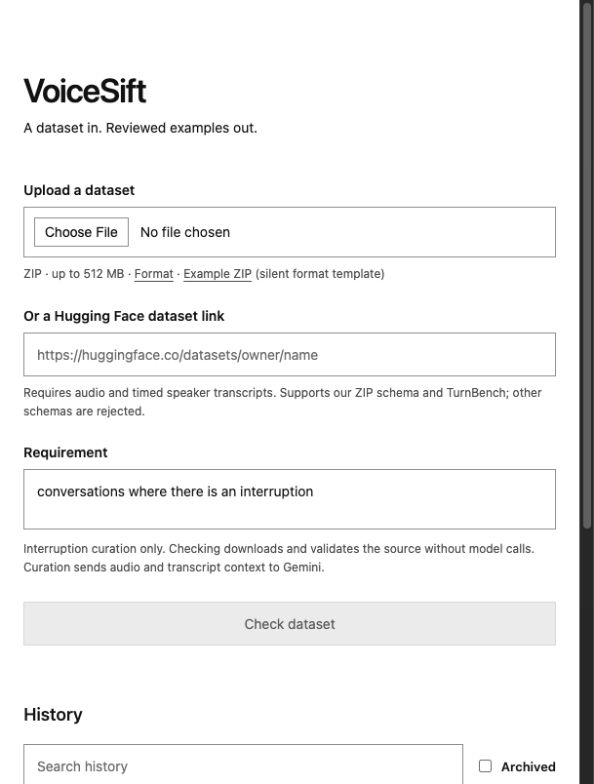
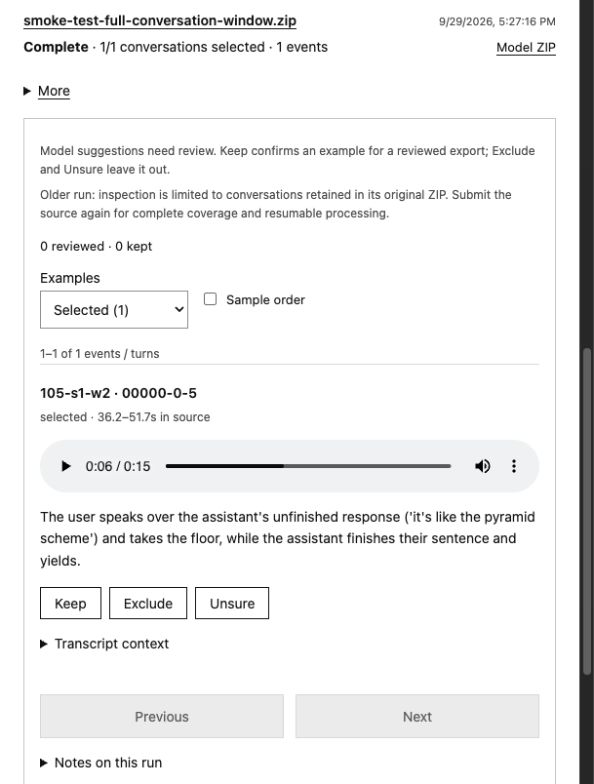

# VoiceSift

VoiceSift uses **large audio-language models (LALMs)** to help curate voice datasets. The goal is to extract relevant examples from larger collections using **freeform text objectives**: describe what you want, review the matches, and export a curated dataset.

The current implementation is a minimal localhost app; no GPU, Docker or database setup is required.

<p>
  
  
</p>

*Choose a source, then listen and review. Screenshots show a development run, not benchmark results.*

**Current beta:** type an objective, check a supported dataset, then curate with Gemini. Freeform goals evaluate complete recordings up to five minutes / 14 MB normalized WAV; the default interruption objective retains its tested overlap workflow when timed transcripts are supplied. Model interpretations and suggestions need review. Tested on macOS; other platforms are not yet verified.

## Get started

You need Git, [uv](https://docs.astral.sh/uv/getting-started/installation/), [Node.js](https://nodejs.org/en/download) 24 and pnpm, plus a [Gemini API key](https://ai.google.dev/gemini-api/docs/api-key) with access to `gemini-3.8-flash` and available quota. Python 3.12 is installed by uv if needed.

```sh
# If pnpm is not already installed:
npm install -g pnpm@12.6.0

git clone https://github.com/ArmaanSayyad/voicesift.git
cd voicesift
sh scripts/setup.sh core
(cd curation-web && pnpm install --frozen-lockfile && pnpm build)
```

Start the server; enter your key at the hidden prompt:

```sh
.venv/bin/python -c 'import getpass, os; os.environ["GEMINI_API_KEY"] = getpass.getpass("Gemini API key: "); from repair_bench.curation.api import main; main()'
```

Open **http://127.0.0.1:8766/**. Keep the terminal running. If `GEMINI_API_KEY` is already set in your environment, simply run `.venv/bin/curation-serve`. Stop with **Ctrl+C**; rerun either startup command to restart. No reinstall is needed.

## Curate a dataset

1. Upload a **ZIP containing `dataset.jsonl` and audio**, or paste a supported Hugging Face dataset URL. [Format and limits](docs/DATASET_RUNS.md#supported-sources). The app’s Example ZIP is a silent format template, not real speech.
2. Describe what to keep, such as “recordings containing laughter but no coughing.” Click **Check dataset** to download/validate it without model calls, then **Curate dataset** to start analysis.
3. Open its history entry. Listen, inspect transcripts, and mark examples **Keep / Exclude / Unsure**. Filters let you check rejected, unresolved and unproposed examples too.
4. **Prepare reviewed ZIP**, then download it. Only explicitly kept events receive positive annotations. **Model ZIP** downloads the original unverified selections.

Pause/resume, retry failures, undo reviews, search, archive/restore and rerun are available in history. Earlier export versions are preserved.

## Know before running

- **Inputs:** audio is required; timed `assistant`/`user` transcripts are optional. Supports our manifest format and `mundo-ai/turn-benchmark-dev`; arbitrary Hub schemas and raw-audio transcription are unsupported. ZIP uploads: 512 MB; selected Hub files: up to 6 GB.
- **Privacy and cost:** curation sends your objective and audio to Gemini; the interruption path also sends nearby transcripts. Freeform runs use one planning call plus one call per recording, with exact-result caching. Checking can download the full supported source. Paid analysis uses your API quota; there is no dollar spending cap.
- **Persistence:** history, audio, reviews and exports stay under `artifacts/interruption-curation/dataset-runs/`. Back up the whole directory. Deleting a run retains shared caches. Run one server process locally; this is not a hosted multi-user service.
- **Quality:** the interruption workflow uses overlap to propose candidates; overlap alone does not prove interruption. Freeform goals judge complete audio directly. [Prior benchmarks](docs/README.md) do not establish accuracy for arbitrary objectives or the new automatic planning step. Ambiguous or unsupported objectives stop with an explanation.

[Setup help, gated datasets, updates and troubleshooting](docs/GETTING_STARTED.md) · [Full workflow and ZIP contents](docs/DATASET_RUNS.md) · [Freeform verification](evidence/freeform-workflow/README.md) · [Interruption verification](evidence/curation-workflow/README.md)

**License:** [MIT](LICENSE), copyright 2026 Armaan Sayyad. The license covers this project’s code; source datasets, recordings and third-party dependencies retain their own licenses.
